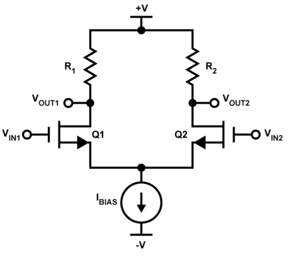

# Ring oscillator analysis

In this document we take into account a 3-stage differential ring oscillator
with differential pairs as stages.

## Minimum gain per stage

We define loop gain as the composition of single stage gains in the number of
stages together with the feedback action:

**loop gain**: $H(s) = - \frac{A_0^3}{(1 + \frac{s}{\omega_0})^3}$

Once defined the loop gain we must satisfy Barkhausen criterion for oscillation.
The modulo of the total gain must be larger than 1. The loop phase shift must be
180 degrees or in general not an integer multiple of 360 degrees.

**Barkhausen criterion**:

- $|H(j\omega_0)| \geq 1$
- $\deg H(j\omega_0) = 180 ^{\circ}$

**minimum phase shift per stage**: Each stage must contribute 180/3=60 degree of
inversion.

$\tan^{-1} w_{osc}/w_0 = 60 \rightarrow w_{\text{osc}} = w_0\sqrt{3}$

**minimum gain per stage**: enforcing the first criteria we get the lower bound
for stage gain replacing $w_{\text{osc}}/w_0$ with the previous result

$\frac{A_0^3}{[\sqrt{1+ (w_{\text{osc}}/w_0})^2]^3} = 1  \rightarrow A_0 = 2$

Barkhausen criterion is necessary but not sufficient so the stage gain we
derived represents a lower bound which in practice is far from the required
gain. Through this lower bound and the single stage differential gain definition
we can experiment with different bias currents and resistor values.

## Single stage analysis: differential pair

In our implementation the MOSFETs are matched and the resistor have the same
value $R_1 = R_2 = R_D$ (drain resistor). We want to define the differential
gain so to relate actual circuit components to the gain required for
oscillation:

**differential gain**: $A_{\text{diff}} = g_m \times R_D$

We see that gain is proportional to pair resistance and MOSFET's
transconductance

**transconductance**:
$g_m=\sqrt{2\mu_nC_{\text{ox}}\left(\frac{W}{L}\right)I_D}=\sqrt{\mu_nC_{\text{ox}}\left(\frac{W}{L}\right)I_{BIAS}}$

We can see above that transconductance is proportional to bias current and
MOSFET physical characteristics.

- $\mu_n$: electron mobility
- $C_{\text{ox}}$: oxide capacitance per unit area (sometimes these two
  parameters are written as $k_n = \mu_n C_{\text{ox}}$, the process
  transconductance parameter)
- $W/L$: aspect ratio, the ratio of transistor channel width to channel length

Stage gain can then be regulated through bias currents, drain resistors, and
MOSFET choice (transconductance).
